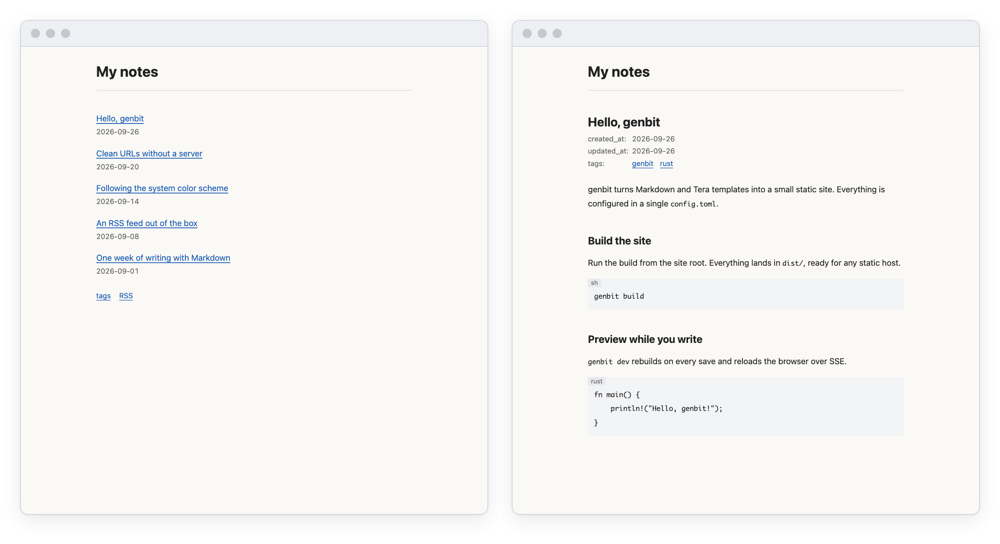

<p align="center">
  <picture>
    <source media="(prefers-color-scheme: dark)" srcset="docs/assets/logo-dark.svg">
    
  </picture>
</p>

<p align="center">
  Markdownブログのための小さな静的サイトジェネレーター。<br>
  バイナリ1つで、<code>new</code>・<code>build</code>・<code>dev</code> だけ。
</p>

<p align="center">
  <picture>
    <source media="(prefers-color-scheme: dark)" srcset="docs/assets/screenshot-dark.png">
    
  </picture>
</p>

> [!NOTE]
> genbitは作者が自分の[ブログ](https://memo.nnenn0.com/)のために作っている個人用のツールです。設定・フロントマター・テンプレート変数・URL・生成物の構成は、どの版でも互換性なく変わる可能性があります。移行手順の提供やサポート、機能要望への対応はしません。使う場合はバージョンを固定してください。

## 特徴

- **バイナリ1つ** — サイトの作成・ビルド・プレビューを1つのCLIで行います。
- **Markdown + Tera** — 記事はTOMLフロントマター付きのMarkdownで書き、ページは[Tera](https://keats.github.io/tera/)テンプレートで組み立てます。
- **ライブリロード** — `genbit dev` は保存のたびに再ビルドし、SSEでブラウザーを再読み込みします。再ビルドに失敗しても、最後に成功したサイトを配信し続けます。
- **CSSのインライン化とHTML圧縮** — CSSはテンプレートごとにインライン展開し、全ページを圧縮します。初期テーマはJavaScriptなしでOSのライト/ダーク設定に追従します。
- **メタデータとRSSの生成** — canonicalリンク、`sitemap.xml`、`robots.txt`、Open Graph、JSON-LD、RSS 2.0フィードを生成します。
- **タグ・見出しリンク・拡張子なしURL** — タグページ、リンク付きの見出し、コードブロックの言語ラベル、拡張子なしの記事URLに対応します。
- **失敗しても `dist/` を壊さないビルド** — ビルドは一時領域で行い、成功したときだけ `dist/` を入れ替えます。URLの衝突やシンボリックリンクの入力は拒否します。

## インストール

[GitHub Releases](https://github.com/nnenn0/genbit/releases)でビルド済みバイナリを配布しています。

| プラットフォーム | ターゲット |
| --- | --- |
| Linux x86_64（静的リンク） | `x86_64-unknown-linux-musl` |
| macOS Apple Silicon | `aarch64-apple-darwin` |

```sh
VERSION=$(curl -fsSLI -o /dev/null -w '%{url_effective}' https://github.com/nnenn0/genbit/releases/latest | sed 's|.*/||')
TARGET=aarch64-apple-darwin # Linuxでは x86_64-unknown-linux-musl
curl -fsSLO "https://github.com/nnenn0/genbit/releases/download/$VERSION/genbit-$VERSION-$TARGET.tar.gz"
curl -fsSLO "https://github.com/nnenn0/genbit/releases/download/$VERSION/SHA256SUMS"
shasum -a 256 --check --ignore-missing SHA256SUMS
tar -xzf "genbit-$VERSION-$TARGET.tar.gz"
install "genbit-$VERSION-$TARGET/genbit" ~/.local/bin/
```

`VERSION` には最新のリリースのタグ（例: `v0.1.2`）が入ります。特定の版を入れるときは直接指定してください。`~/.local/bin` は `PATH` に含まれる任意のディレクトリに置き換えてください。アーカイブには、genbitが含む依存クレートのライセンスをまとめた `THIRD_PARTY_LICENSES.md` も入っています。

<details>
<summary>Artifact Attestationsの検証、macOSのGatekeeper、ソースからのビルド</summary>

各アーカイブには[GitHub Artifact Attestations](https://docs.github.com/actions/security-for-github-actions/using-artifact-attestations)を付けています。GitHub CLIがあれば、このリポジトリのワークフローでビルドされたことを確認できます。

```sh
gh attestation verify "genbit-$VERSION-$TARGET.tar.gz" --repo nnenn0/genbit
```

macOSのバイナリは署名・公証していません。ブラウザーでダウンロードして実行を拒否された場合は、`com.apple.quarantine` 属性を外してください。

```sh
xattr -d com.apple.quarantine genbit
```

Rust 1.98.1のCargoが使える環境では、ソースからもインストールできます。

```sh
cargo install --locked --git https://github.com/nnenn0/genbit --tag "$VERSION"
```

</details>

## クイックスタート

```sh
genbit new my-blog
cd my-blog
genbit dev      # http://127.0.0.1:3000
```

`config.toml` を編集し、`content/` の下にMarkdownを追加します。公開するときは次を実行します。

```sh
genbit build    # dist/ にサイトを生成
```

`dist/` の中身を静的ホスティングサービスへ配置してください。公開先は `/entries/hello-world` を `entries/hello-world.html` から配信し、`404.html` をHTTP 404で返せる必要があります。

## コマンド

| コマンド | 内容 |
| --- | --- |
| `genbit new <name>` | 設定・テンプレート・CSS・サンプル記事を含む新しいサイトのディレクトリを作ります。既存のパスは上書きしません。 |
| `genbit build` | カレントディレクトリのサイトを `dist/` へビルドします。記事内のサイト内リンクの参照先がなければ失敗します。 |
| `genbit build --dry-run` | ビルドと同じ検査をすべて行い、`dist/` は変更しません。 |
| `genbit dev [--host <ip>] [--port <port>]` | ビルドして `dist/` を配信し（既定は `127.0.0.1:3000`）、変更があれば再ビルドして再読み込みします。 |

## サイトの構成

```text
my-blog/
├── config.toml          # title, description, site_url, og_image, timezone
├── content/             # Markdownの記事 → /entries/hello-world
│   └── entries/hello-world.md
├── templates/           # Teraテンプレート: base, page, root, tags, tag, entry-list, 404
├── styles/              # common.css と、テンプレート別の任意CSS
└── static/              # そのままコピー（favicon、OGP画像など）
```

```markdown
+++
title = "最初の記事"
description = "記事で扱う内容を簡潔に説明します。"
created_at = 2026-09-26 09:00
updated_at = 2026-09-26 09:00
tags = ["rust", "web"]
+++

ここに本文を書きます。
```

## ドキュメント

| ドキュメント | 内容 |
| --- | --- |
| [設定](docs/configuration.md) | `config.toml` の項目とURLの規則 |
| [コンテンツ](docs/content.md) | フロントマター、タグ、記事URL、Markdownの処理 |
| [テンプレートとCSS](docs/templates.md) | テンプレート変数、CSSの合成、初期テーマ |
| [出力と公開](docs/output.md) | 生成ファイル、`dist/` の保護、公開先の条件、開発サーバー |
| [開発](docs/development.md) | Dockerを使ったgenbit自体の開発 |

## 既知の制限

- 公開先はドメインのルートに限ります。サブパス（例: `https://example.com/blog/`）への配置には対応していません。
- 公開先が、生成した `.html` ファイルを拡張子なしのURLで配信できる必要があります。
- 初期テンプレートとサンプル記事は日本語で、`<html lang="ja">` を出力します。他の言語で使う場合は `templates/base.html` を編集してください。
- 本文で参照するローカルのPNG・JPEG・GIF・WebPには、レイアウトシフトを防ぐ寸法属性を自動で付けます。画像の最適化は行いません。画像は外部ツールで事前に処理してください（[docs/content.md](docs/content.md#画像)）。
- シンタックスハイライトは行いません。
- ビルド済みバイナリはLinux x86_64とmacOS Apple Siliconだけです。Windowsには対応していません。

`dist/` の入れ替えに関する例外的なケースは[出力と公開](docs/output.md#既知の制限)を参照してください。

## ライセンス

ライセンスは[MIT License](LICENSE)です。genbitのコードと、同梱する初期テンプレート・CSS・サンプル記事・favicon・OGP画像に適用します。`genbit new` でサイトへコピーされた初期素材を再配布するときも、著作権表示とライセンス文を残してください。利用者が自分で書いた記事や追加した素材には、このライセンスを適用しません。外部のRust依存関係には、それぞれのライセンスが適用されます。
